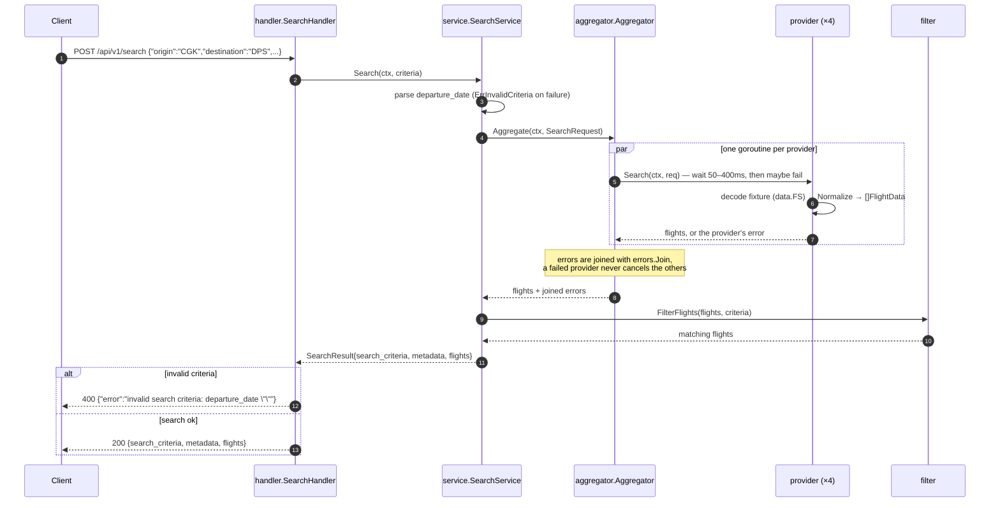

# Overview

[](https://github.com/setiahartono)
[](https://linkedin.com/in/setiahartono)

A simple API to simulate aggregation of flight data from various providers by mocking the said providers API call response.

## How it Works
- An HTTP request consisting of search criteria is placed into the API
- HTTP request will be passed to the handler which will invoke the Search Service
- Search service will load the providers through the aggregation layer
- Each provider simulates API call which will received simulated response body, latencies, and failure chances
- The calls are being run parallely by using Go Routines
- Each provider will normalize the response body received to an uniformed format
- The normalized responses of the providers are collected in the aggregation layer
- The aggregated data will then be filtered based on search criteria
- The final data is then passed from the Search Service to the handler
- The handler renders the response body in a JSON format

### Flow Diagram

```text
 client
   │ POST /api/v1/search  {criteria}
   ▼
 server.NewRouter ─▶ handler.SearchHandler.Search                (internal/handler)
   │                      decode criteria · render JSON · {"error": "..."} when it fails
   ▼
 service.SearchService.Search                                    (internal/service)
   │                      validate departure_date · build metadata
   ▼
 aggregator.Aggregator.Aggregate                                 (internal/aggregator)
   │                      one goroutine per provider, errors joined
   │      ┌───────────────┬───────────────┬───────────────┐
   ▼      ▼               ▼               ▼               ▼
 Garuda  Lion Air      Batik Air      AirAsia            (internal/provider)
 50–100  100–200 ms    200–400 ms     50–150 ms          wait → maybeFail → decode
   │      │               │               │
   └──────┴───────────────┴───────────────┘
   │        Normalize(response) → uniform FlightData        (data.FS fixtures · utils)
   ▼
 filter.FilterFlights(flights, criteria)                         (internal/filter)
   │        origin · destination · departure_date · passengers · cabin_class
   ▼
 SearchResult{ search_criteria, metadata, flights }
   │
   ▼
 client  ◀── 200 JSON
```

### Request Sequence



### Simulated Provider Behaviour

| Provider | Latency | Failure |
|---|---|---|
| Garuda Indonesia | 50–100 ms | — |
| Lion Air | 100–200 ms | — |
| Batik Air | 200–400 ms | — |
| AirAsia | 50–150 ms | ~10% (`provider.ErrUnavailable`) |

Because the providers are queried in parallel, a search takes about as long as the slowest one
(Batik Air, up to 400 ms) rather than the sum of all four.

## What's Included
- The API
- Test Cases
- Test Data

## What's Not Included
- Database Connection
- Config

## Setup

Requires Go 1.26.

```bash
go run .                    # listens on :8080
PORT=3000 go run .          # or pick another port
go test ./...               # run the tests
```

| Method | Path | Body |
|---|---|---|
| GET | `/api/v1/ping` | – |
| POST | `/api/v1/search` | search criteria JSON |

```bash
curl -s localhost:8080/api/v1/ping

curl -s -X POST localhost:8080/api/v1/search \
  -H 'Content-Type: application/json' \
  -d '{"origin":"CGK","destination":"DPS","departure_date":"2025-12-15","passengers":1,"cabin_class":"economy"}'
```

A search answers with the criteria it applied, the run metadata and the unified flights. The sample below
had one provider fail: the flights of the other three still come back and `providers_failed` reports it.

```json
{
  "search_criteria": {"origin": "CGK", "destination": "DPS", "departure_date": "2025-12-15", "passengers": 1, "cabin_class": "economy"},
  "metadata": {"total_results": 5, "providers_queried": 4, "providers_failed": 1, "search_time_ms": 274, "cache_hit": false},
  "flights": [
    {
      "id": "JT740_Lion Air",
      "provider": "Lion Air",
      "airline": {"name": "Lion Air", "code": "JT"},
      "flight_number": "JT740",
      "departure": {"airport": "CGK", "city": "Jakarta", "datetime": "2025-12-15T05:30:00", "timestamp": 1765751400},
      "arrival": {"airport": "DPS", "city": "Denpasar", "datetime": "2025-12-15T08:15:00", "timestamp": 1765757700},
      "duration": {"total_minutes": 105, "formatted": "1h 45m"},
      "stops": 0,
      "price": {"amount": 950000, "currency": "IDR"},
      "available_seats": 45,
      "cabin_class": "ECONOMY",
      "aircraft": "Boeing 737-900ER",
      "amenities": [],
      "baggage": {"carry_on": "7 kg", "checked": "20 kg"}
    }
  ]
}
```

Errors are JSON as well, `{"error": "<message>"}`: `400` for an unreadable body or invalid criteria
(for example a missing or malformed `departure_date`), `500` for anything unexpected.