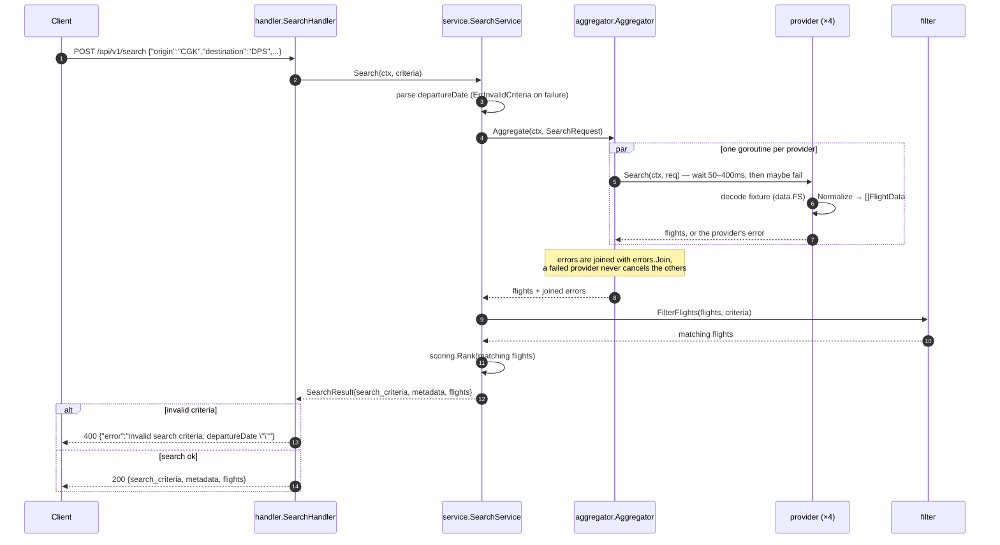

# Overview

[](https://github.com/setiahartono)
[](https://linkedin.com/in/setiahartono)

A simple API to simulate aggregation of flight data from various providers by mocking the said providers API call response.

## How it Works
- An HTTP request consisting of search criteria is placed into the API
- HTTP request will be passed to the handler which will invoke the Search Service
- Search service will load the providers through the aggregation layer
- Each provider simulates API call which will received simulated response body, latencies, and failure chances
- The calls are being run parallely by using Go Routines
- Each provider will normalize the response body received to an uniformed format
- The normalized responses of the providers are collected in the aggregation layer
- The aggregated data will then be filtered based on search criteria
- The filtered flights are scored by best value, from the fare and how convenient the itinerary is
- The final data is then passed from the Search Service to the handler
- The handler renders the response body in a JSON format

### Flow Diagram

```text
 client
   │ POST /api/v1/search  {criteria}
   ▼
 server.NewRouter ─▶ handler.SearchHandler.Search                (internal/handler)
   │                      decode criteria · render JSON · {"error": "..."} when it fails
   ▼
 service.SearchService.Search                                    (internal/service)
   │                      validate departureDate · build metadata
   ▼
 aggregator.Aggregator.Aggregate                                 (internal/aggregator)
   │                      one goroutine per provider, errors joined
   │      ┌───────────────┬───────────────┬───────────────┐
   ▼      ▼               ▼               ▼               ▼
 Garuda  Lion Air      Batik Air      AirAsia            (internal/provider)
 50–100  100–200 ms    200–400 ms     50–150 ms          wait → maybeFail → decode
   │      │               │               │
   └──────┴───────────────┴───────────────┘
   │        Normalize(response) → uniform FlightData        (data.FS fixtures · utils)
   ▼
 filter.FilterFlights(flights, criteria)                         (internal/filter)
   │        origin · destination · departure_date · passengers · cabin_class
   ▼
 scoring.Rank(filtered)                                          (internal/scoring)
   │        best value first: 0.7 · price + 0.3 · convenience
   ▼
 SearchResult{ search_criteria, metadata, flights }
   │
   ▼
 client  ◀── 200 JSON
```

### Request Sequence



### Simulated Provider Behaviour

| Provider | Latency | Failure |
|---|---|---|
| Garuda Indonesia | 50–100 ms | — |
| Lion Air | 100–200 ms | — |
| Batik Air | 200–400 ms | — |
| AirAsia | 50–150 ms | ~10% (`provider.ErrUnavailable`) |

Because the providers are queried in parallel, a search takes about as long as the slowest one
(Batik Air, up to 400 ms) rather than the sum of all four.

### Best Value Scoring

The flights that survive the filter are scored by best value in
[`internal/scoring`](internal/scoring), and the result lists them best value first, so
`flights[0]` is the flight to recommend. Every flight is compared to the best the subset
offers: the cheapest fare, and the quickest itinerary with the fewest stops.

```text
value       = 0.7 · price       + 0.3 · convenience
price       = cheapest fare / fare      → 1 for the cheapest, 0.5 when it costs twice as much
convenience = 0.6 · travel time + 0.4 · stops
travel time = shortest trip / trip      → 1 for the quickest
stops       = 1 / (1 + stops)           → 1 direct, 0.5 with a stop, 0.333 with two
```

Each flight carries the outcome in `score` (`provider.Score`, merged into
`provider.FlightData`), rounded to three decimals, and `score.value` is the weighted sum of
`score.price` and `score.convenience`. A fare or a travel time a provider could not normalize
(zero) earns no credit for that component, while the stops always count. Flights that score the
same keep the order the providers answered in.

The sample response below shows why the fare alone does not decide: the 485000 fare takes
4h 20m with a stop, so the best value is a 595000 non-stop that arrives in 1h 40m.

## What's Included
- The API
- Test Cases
- Test Data

## What's Not Included
- Database Connection
- Config

## Setup

Requires Go 1.26.

```bash
go run .                    # listens on :8080
PORT=3000 go run .          # or pick another port
go test ./...               # run the tests
```

| Method | Path | Body |
|---|---|---|
| GET | `/api/v1/ping` | – |
| POST | `/api/v1/search` | search criteria JSON |

### Request

The body of `POST /api/v1/search` is camelCase:

| Field | Type | |
|---|---|---|
| `origin` | string | departure airport code, e.g. `CGK` |
| `destination` | string | arrival airport code, e.g. `DPS` |
| `departureDate` | string | date of the trip, `YYYY-MM-DD`, mandatory |
| `passengers` | int | travellers to seat |
| `cabinClass` | string | e.g. `economy`, matched case insensitively |
| `roundTrip` | bool, optional | accepted for the round trip search, which is not searched yet |

The response keeps snake_case: `search_criteria` reports `departure_date` and `cabin_class`, and
it never echoes `roundTrip`. Snake_case request keys are no longer read, so a body written with
`departure_date` is answered with `400 invalid search criteria: departureDate ""`, which names the
key the endpoint reads.

```bash
curl -s localhost:8080/api/v1/ping

curl -s -X POST localhost:8080/api/v1/search \
  -H 'Content-Type: application/json' \
  -d '{"origin":"CGK","destination":"DPS","departureDate":"2025-12-15","passengers":1,"cabinClass":"economy"}'
```

A search answers with the criteria it applied, the run metadata and the unified flights, best
value first. This run had no provider fail; when one does, the flights of the other three still
come back and `providers_failed` reports it.

```json
{
  "search_criteria": {"origin": "CGK", "destination": "DPS", "departure_date": "2025-12-15", "passengers": 1, "cabin_class": "economy"},
  "metadata": {"total_results": 9, "providers_queried": 4, "providers_failed": 0, "search_time_ms": 288, "cache_hit": false},
  "flights": [
    {
      "id": "QZ532_AirAsia",
      "provider": "AirAsia",
      "airline": {"name": "AirAsia", "code": "QZ"},
      "flight_number": "QZ532",
      "departure": {"airport": "CGK", "city": "Jakarta", "datetime": "2025-12-15T19:30:00+07:00", "timestamp": 1765801800},
      "arrival": {"airport": "DPS", "city": "Denpasar", "datetime": "2025-12-15T22:10:00+08:00", "timestamp": 1765807800},
      "duration": {"total_minutes": 100, "formatted": "1h 40m"},
      "stops": 0,
      "price": {"amount": 595000, "currency": "IDR"},
      "available_seats": 72,
      "cabin_class": "economy",
      "aircraft": null,
      "amenities": [],
      "baggage": {"carry_on": "Cabin baggage only", "checked": "additional fee"},
      "score": {"value": 0.87, "price": 0.815, "convenience": 1}
    }
  ]
}
```

Errors are JSON as well, `{"error": "<message>"}`: `400` for an unreadable body or invalid criteria
(for example a missing or malformed `departureDate`), `500` for anything unexpected.